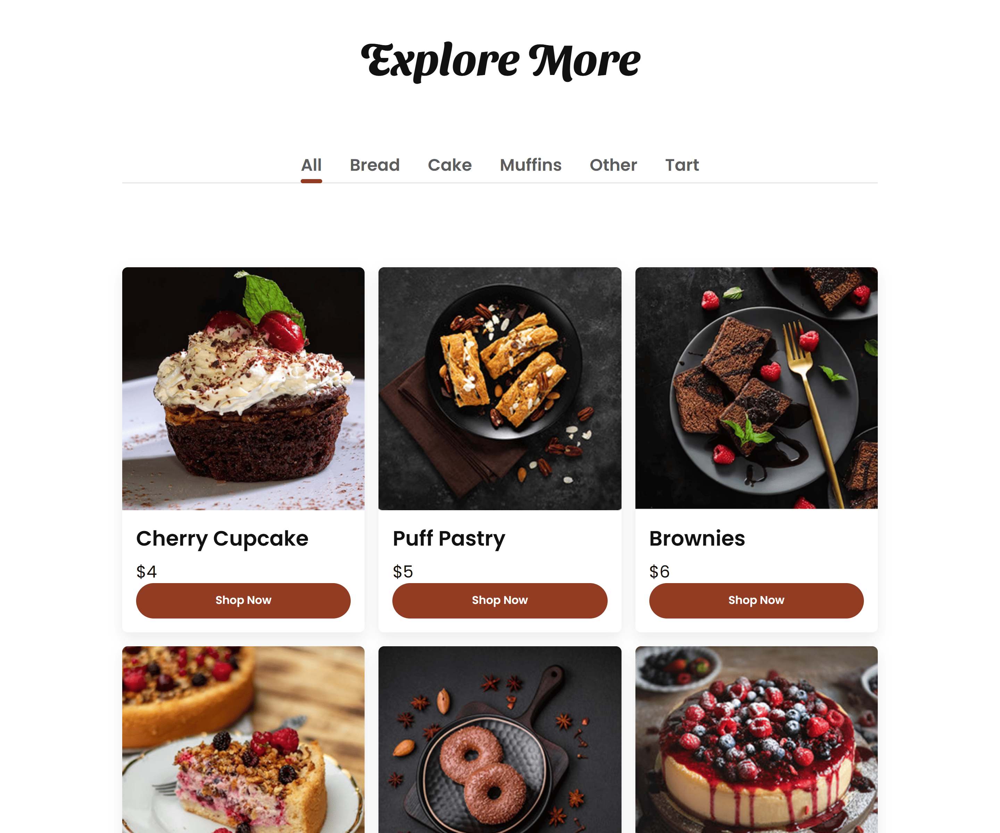
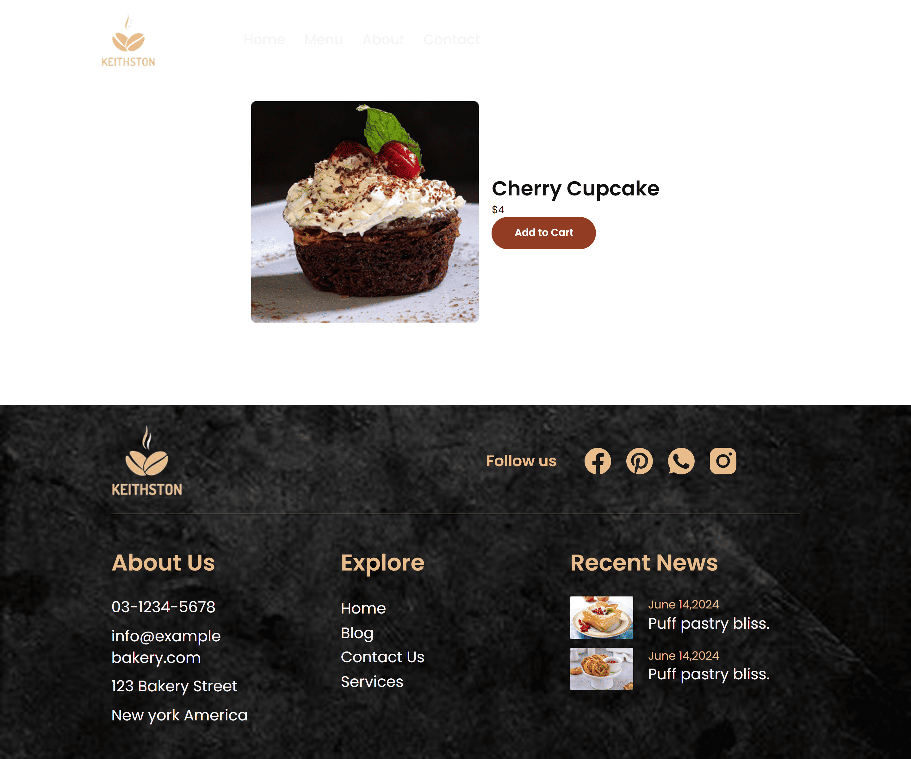

# 🍞 Bakery Theme – WordPressオリジナルテーマ

## 🔗 概要

Figmaで作成したデザインをもとに制作した、架空のベーカリーサイトのWordPressオリジナルテーマです。

実案件を意識した保守性・再利用性・WordPressらしい実装を重視しました。

---

# 📸 スクリーンショット

### Home Page

### Product Page

### Single Product Page

---

# 📝 アプリ概要

Bakery Themeは、架空のベーカリーサイトを想定したWordPressオリジナルテーマです。

単にデザインを再現するだけではなく、管理画面からコンテンツを更新できるようAdvanced Custom Fields（ACF）を導入し、カスタム投稿・カスタムタクソノミー・共通テンプレート化など、実務を意識した設計で制作しました。

---

# 🔧 使用技術

### フロントエンド

* HTML
* CSS
* JavaScript

### バックエンド

* PHP
* WordPress

### CMS

* WordPress
* Advanced Custom Fields（ACF）
* Contact Form 7

### データベース

* MySQL

### 開発環境

* Docker
* Docker Compose

### バージョン管理

* Git
* GitHub

---

# ✨ 主な機能

## 🏠 トップページ

* メインビジュアル（ACF管理）
* Top Products
* Explore More
* Featured Treats
* レスポンシブ対応

---

## 🍞 商品管理

* カスタム投稿（Product）
* アイキャッチ画像
* 商品説明
* 価格（ACF）
* おすすめ商品設定
* Top Products表示設定

---

## 🏷 カテゴリー機能

* カスタムタクソノミー
* カテゴリータブ切り替え
* 商品絞り込み表示
* All表示対応

---

## 📄 商品詳細ページ

* 商品画像
* 商品名
* 価格
* 商品説明
* Add to Cartボタン（ダミー）

---

## 👤 Aboutページ

管理画面から以下を編集可能です。

* Hero
* Story
* Philosophy

---

## 📞 Contactページ

* Google Maps埋め込み
* Contact Form 7
* 営業時間
* 住所
* 電話番号
* メールアドレス

すべて管理画面から更新できます。

---

## 🚨 404ページ

オリジナル404ページを作成しています。

---

## 📱 レスポンシブ対応

以下の表示に対応しています。

* PC
* タブレット
* スマートフォン

---

# 💡 工夫した点・学び

## コンポーネント化

商品カードをテンプレートパーツとして共通化しました。

* `get_template_part()`

を利用することで、重複コードを削減し保守性を向上させています。

---

## WordPressらしい実装

以下のWordPress標準機能を積極的に利用しました。

* WP_Query
* Custom Post Type
* Custom Taxonomy
* ACF
* Template Hierarchy

また、セキュリティを意識し、

* `esc_html()`
* `esc_url()`
* `esc_attr()`
* `sanitize_text_field()`

などのエスケープ・サニタイズ処理を適切に行っています。

---

## 保守性を意識した設計

共通クラスやテンプレートを利用し、将来的な機能追加や修正がしやすい構成を目指しました。

例

* `.btn`
* `.page-content`
* `template-parts/product-card.php`

---

## 管理画面から更新可能

コードを書き換えなくても管理画面から以下を編集できます。

* メインビジュアル
* 商品情報
* 商品価格
* 商品画像
* Aboutページ
* Contactページ
* おすすめ商品

実案件での運用を想定した構成としています。

---

# 🔮 今後の改善予定

* search.php
* archive.php
* page.php
* ページネーション
* パフォーマンス改善
* アクセシビリティ対応

---

# 👤 作者

**T. Nakanishi**

GitHub
https://github.com/t-nakanishi-dev
